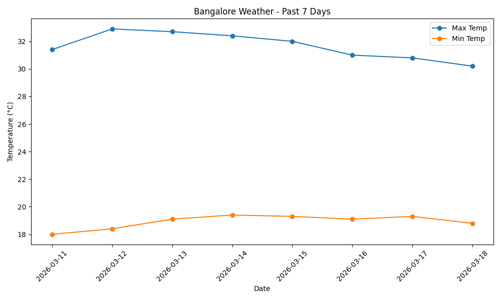

# 🌦️ Bangalore Weather Analysis (Python)

A simple Python project that fetches and visualizes weather data for Bangalore over the past 7 days using the Open-Meteo API.

---

## 📌 Overview

This project demonstrates how to:

* Work with real-world APIs
* Process and analyze data using pandas
* Visualize trends using matplotlib
* Save structured data for reuse

---

## 📍 Location

* **City:** Bangalore, India
* **Coordinates:** 12.9716, 77.5946
* Coordinates were obtained using an online latitude/longitude lookup tool.

---

## ⚙️ Features

* 📡 Fetches weather data from an API
* 🌡️ Extracts daily minimum and maximum temperatures
* 📊 Generates a line chart of temperature trends
* 💾 Saves the dataset as a CSV file

---

## 🛠️ Tech Stack

* Python
* requests
* pandas
* matplotlib

---

## 📊 Output

### Temperature Trend Chart



### Data File

* Stored at: `data/bangalore_weather.csv`

---

## 🚀 How to Run

1. Clone the repository:

   ```bash
   git clone https://github.com/harsimran-kaur01/weather-data-analysis.git
   cd bangalore-weather-analysis
   ```

2. Install dependencies:

   ```bash
   pip install -r requirements.txt
   ```

3. Run the script:

   ```bash
   python weather.py
   ```

---

## 🌐 API Used

* Open-Meteo API
  https://open-meteo.com/

---

## 📁 Project Structure

```
bangalore-weather-analysis/
│── weather.py
│── README.md
│── weather_chart.png
│── data/
    └── bangalore_weather.csv
```

---

## ⚠️ Notes

* The script dynamically fetches data for the last 7 days
* Internet connection is required to access the API
* Ensure all dependencies are installed before running

---

## 🔮 Future Improvements

* 🌍 Support for multiple cities
* 🔄 User input for location
* 📈 Add more weather parameters (humidity, wind, rainfall)
* 🌐 Build a web app using Streamlit or Flask
* ⏱️ Automate daily data updates

---

## 👨‍💻 Author

Harsimran Kaur

---

## ⭐ Support

If you found this project useful, consider giving it a star ⭐
